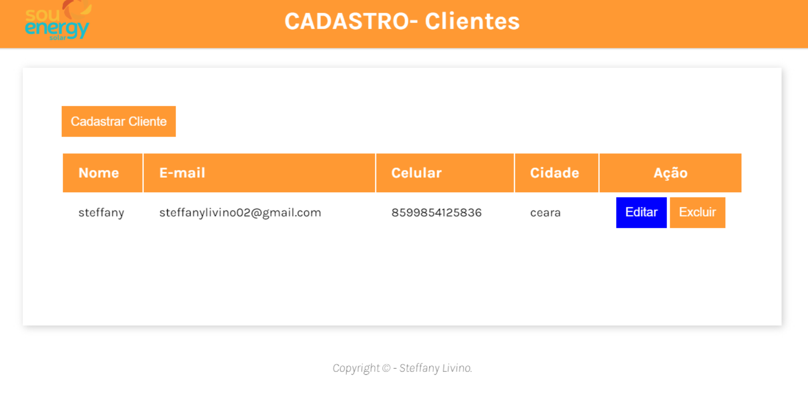

<h1 align="center"> Cadastro de Clientes  </h1>

  <a href="#-tecnologias">Tecnologias</a>&nbsp;&nbsp;&nbsp;|&nbsp;&nbsp;&nbsp;
  <a href="#-projeto">Projeto</a>&nbsp;&nbsp;&nbsp;|&nbsp;&nbsp;&nbsp;

  

## 🚀 Tecnologias

Esse projeto foi desenvolvido com as seguintes tecnologias:

- HTML e CSS
- JavaScript
- Git e Github

## 💻 Projeto
este é um projeto que funciona como uma pokédex, ele exibe as seguintes informações sobre 650 Pokémons diferentes evoluções e personagens:

- Imagem
- Nome
- ID
  
este projeto tem a finalidade de capitar e cadastrar novos clientes, como: Nome, E-mail, Celular, e Cidade. para melhor organização e praticidade.

Feito com ♥ by Steffany Livino  
